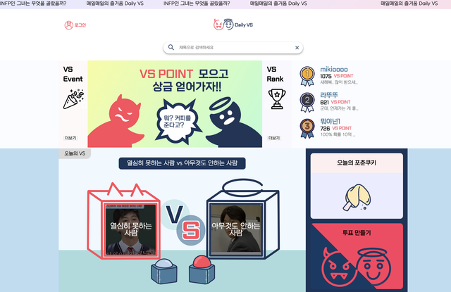

<div align="center">
  <h1>DailyVS <a href="https://daily-vs.com/" target="_blank"></a></h1>
  <strong>하루하루, 투표와 통계로 느끼는 재미 DailyVS 🗳️</strong>
</div>
<br><br>


<div align="center">
  
</div>

</div>

## 📝 DailyVS 소개

DailyVS는 사용자들이 성별, 나이, MBTI 등 다양한 카테고리에 따라 의견이 갈리는 주제에 대해 투표하고 통계를 조회할 수 있는 웹사이트입니다. 소소한 재미를 제공하며, 참여자들이 의견 다양성을 존중하고 서로의 차이를 인정하는 공간을 마련합니다.

## 1. 제작 기간 & 참여 인원

- 2023년 9월 ~ 2023년 12월
- 팀 프로젝트 (4명)

| Frontend | Backend | Backend | Backend |
| -------- | ------- | ------- | ------- |
| 곽민경   | 김정곤  | 박신빈  | 왕한솔  |

## 2. 사용 기술

### Front - End

- JavaScript
- React
- Styled-Component
- Redux

### Back - End

- Python
- Django
- mysql
- Gunicorn

## 3. ERD 설계

<a href="https://ibb.co/qWL2MKb"></a>

## 4. 핵심 기능

> **메인페이지**

사용자들은 캐러셀과 애니메이션으로 이루어진 동적인 메인 페이지에서 원하는 주제를 선택할 수 있습니다.



> **주제 게시**

사용자들은 투표하고자 하는 주제를 게시할 수 있습니다.

> **투표 진행**

사용자들은 원하는 주제에 대해 투표할 수 있으며 자신의 의견을 직접 게시할 수 있습니다.

> **통계 조회**

다양한 카테고리별로 투표 결과의 통계를 조회할 수 있습니다. 이는 더 나은 시각화를 위해 도넛 차트 형태로 제공됩니다.


> **결과 공유**

사용자는 원하는 통계를 이미지로 저장하거나 SNS에 공유할 수 있습니다.

> **댓글 기능**

각 주제에 대한 커뮤니티 활성화를 위해 댓글을 달 수 있습니다.

</div>

## 5. 트러블 슈팅

> ### 5.5.1 **사용자 카테고리 별 데이터 보존 문제**

- 사용자가 투표 페이지에 접근한 후 비로그인 사용자가 선택한 투표 옵션, 성별, mbti, 나이대를 페이지가 이동되어도 보존해야했습니다.
- React와 DRF로 분리하기 전, Django로 구현했을 당시에는 페이지가 바뀔 때마다, 혹은 사용자의 모든 동작에 대해 서버와 클라이언트 코드가 계속해서 통신을 하였고, 이는 서버 부하와 네트워크 사용량을 높여 체감 속도 또한 느려지는 현상이 있었습니다.
- Django에 포함된 templates를 React코드로 변환하는 과정에서 해당 방식의 비효율을 깨닫고 전역 상태 관리 툴인 리덕스를 도입하였습니다. 이는 클라이언트 사이드에서 사용자의 입력을 중간 저장함으로써 필요한 시점에만 서버와 통신을 하게 되어 서비스의 체감 속도를 크게 개선할 수 있었습니다.

**이전 코드**

<details>
  
```
  
  
  
  
  
  <div class="vote-container">
      <h2>당신의 성별은?</h2>
      <form action="" method="post">
          
          
          <label>
              <input type="radio" name="gender" value="{{ choice.id }}">
              {{ choice.description }}
          </label><br>
          
          <input type="submit" value="투표하기">
      </form>
  </div>
  

```

기존 Django의 `views.py` 파일에서는 페이지가 바뀔 때마다 사용자의 요청을 처리하고 데이터베이스와의 상호작용을 관리합니다.

```
def submit_vote(request):
    if request.method == "POST":
        choice_id = request.POST.get('gender')
        if not choice_id:
            messages.error(request, "선택을 하지 않았습니다.")
            return redirect('vote:vote_form')

        choice = Choice.objects.get(id=choice_id)
        Vote.objects.create(choice=choice)
        messages.success(request, "투표가 성공적으로 완료되었습니다!")
        return redirect('vote:vote_results')
    else:
        choices = Choice.objects.all()
        return render(request, 'vote/detail.html', {'choices': choices})
```

</details>

**개선된 코드**

<details>
액션 생성자 (Action Creators)

리덕스에서 사용자의 투표 선택, 성별, MBTI, 나이대를 저장하는 액션 생성자입니다.

```
export const setChoice = choice => {
  return {
    type: 'SET_CHOICE',
    payload: choice,
  };
};

export const setMBTI = mbti => {
  return {
    type: 'SET_MBTI',
    payload: mbti,
  };
};
```

**리듀서 (Reducer)**

액션 타입에 따라 상태를 어떻게 업데이트할지 결정하는 리듀서입니다.

```
const genderReducer = (state = initialGenderState, action) => {
  switch (action.type) {
    case 'SET_GENDER':
      return { ...state, selectedGender: action.payload };
    default:
      return state;
  }
};

const mbtiReducer = (state = initialMBTIState, action) => {
  switch (action.type) {
    case 'SET_MBTI':
      return { ...state, selectedMBTI: action.payload };
    default:
      return state;
  }
};

```

**스토어 구성 (Store Configuration)**

리덕스 스토어를 생성하고 미들웨어를 적용하여 비동기 처리와 디버깅 도구를 통합합니다.

```
const initialState = {};
const middleware = [thunk];

const store = createStore(
  rootReducer,
  initialState,
  composeWithDevTools(applyMiddleware(...middleware)),
);
```

</details>

> ### 5.5.1 **유저의 로그인 여부에 따른 상태 관리**

- Django로 구현했을 당시에는 Django의 `AuthenticationMiddleware` 를 사용하여 유저의 정보를 `request.user`에 저장하며, 유저의 로그인 상태에 따른 리다이렉션을 쉽게 구현할 수 있었습니다. 예를 들어, 특정 페이지에 접근하려는 유저가 로그인 상태가 아니라면, Django는 자동으로 로그인 페이지로 유저를 리다이렉션할 수 있습니다.
- Django의 세션 기반 인증에서 토큰 기반 인증으로 전환하며, 상태 관리를 프론트엔드로 어떻게 이전할지 고민을 하였습니다. 그 과정에서 로그인하지 않은 사용자가 인증이 필요한 페이지에 접근했을 때 적절한 리다이렉션을 구현하는 방법이나 로그인 상태 변화에 따라 UI를 적절히 업데이트하는 방법에 대한 기능에 관한 사항들도 고려해야 했습니다.

<details>

- **Redux 상태 설계**:

  - `auth` 리듀서를 생성하여 `isLoggedIn`, `user`, `token` 등의 상태를 관리하였습니다.
  - 액션 생성자와 리듀서를 정의하여 로그인, 로그아웃, 토큰 갱신 등의 상태 변경을 처리하였습니다.

- **라우팅 및 리다이렉션 로직 구현**: - 리덕스에 저장된 로그인 상태(`isAuthenticated`)에 따라 라우트의 행동을 달리 지정합니다. 예를 들어, 로그인이 필요한 페이지(예: `/create`, `/my-page`, `/my-page/fix`)에 대해 로그인 상태가 아니면 메인 페이지로 리디렉션하도록 설정하고 있습니다.

```
  <Routes>
  {isAuthenticated ? (
    <Route path="/create" element={<Create />} />
  ) : (
    <Route path="/create" element={<Navigate to="/" replace />} />
  )}
  </Routes>
```


- **토큰 관리**:
    - 로그인 성공 시 토큰을 localStorage와 쿠키에 저장하고,
    - API 호출 시, 저장된 토큰을 `Authorization` 헤더에 포함하여 백엔드에 전송하는 방식을 차용하였습니다.

- **사용자 인터페이스 반응성**:
    - 로그인/로그아웃 시 UI가 동적으로 반응하도록 리액트 컴포넌트를 조정하고
    - 로그인 상태에 따라 네비게이션 바의 표시 항목 변경하는 등의 작업을 통해 UX를 향상시켰습니다.

</details>
